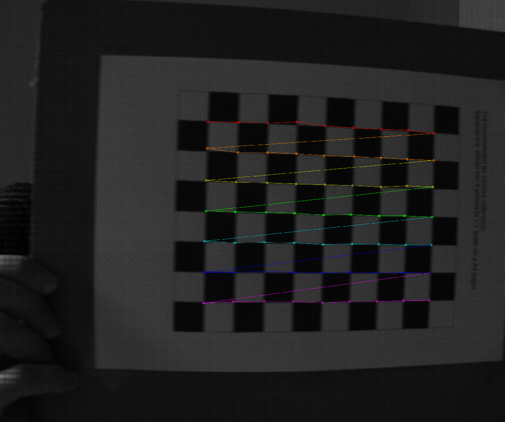
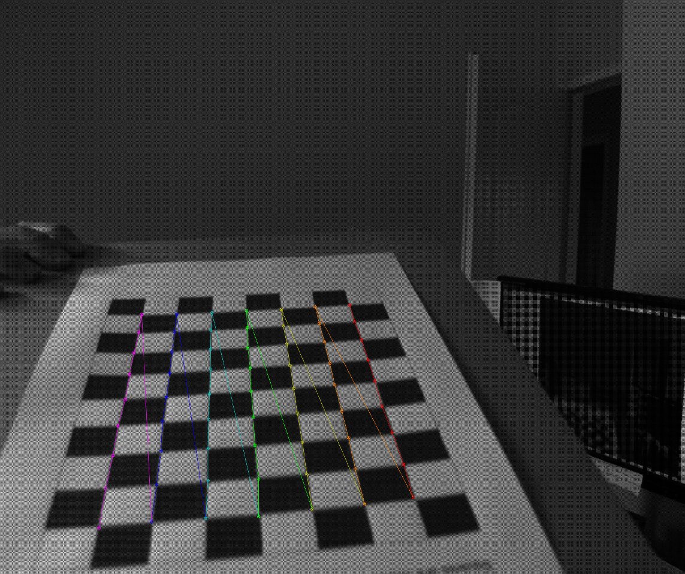
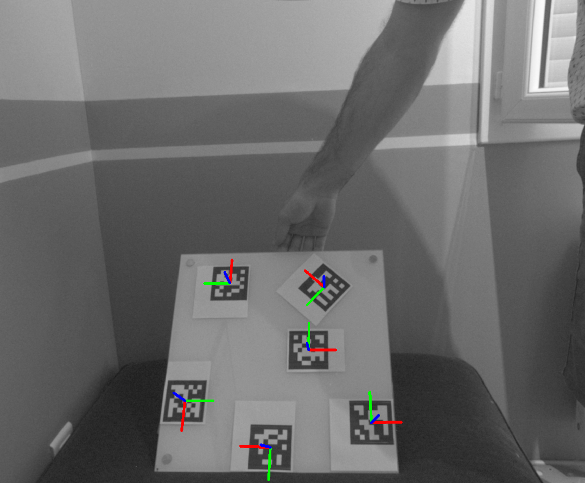
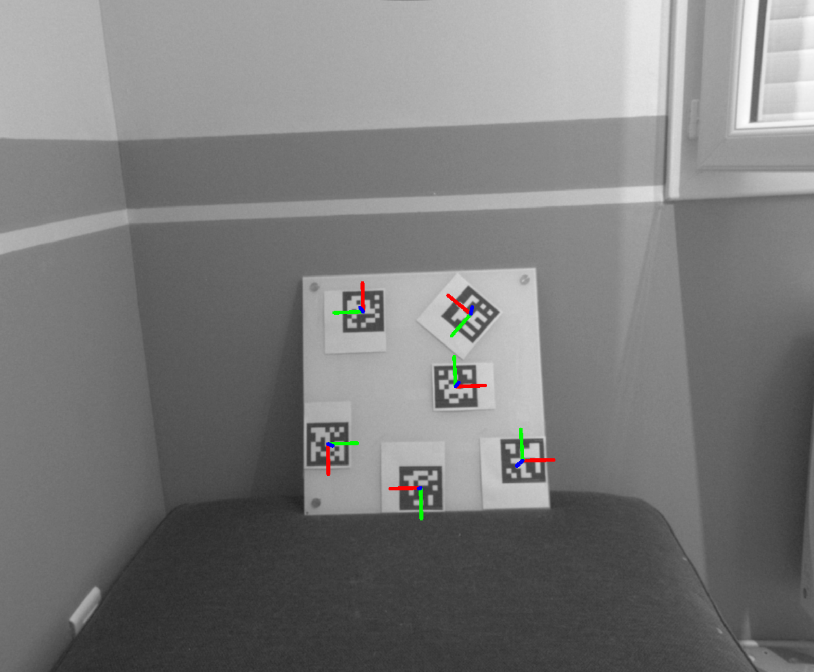

# Geometric calibration module and ArUco markers applications
In this folder, we created a few important modules.

Firstly, a series of scripts to produce the geometric camera calibration of the
polarization camera using Zhang's method.  This method makes use of the checker
board pattern, which is easy to detect, and with it, found a series of 3D points
that will then be used to estimate the intrinsics parameters of the camera. This
method works with both, total intensity or raw image from the polarization
camera. The results of the calibration are stored in a YAML formatted file, to
avoid running it every time we start the system.

The second application makes use of the calibration results to detect ArUco
markers. In this application, we only do the detection of the markers and we
extract their coordinates in the CCF. The detection step requires the image to
be undistorted by the calibration coefficients, and the pose estimation requires
also to know the calibration parameters to estimate correctly the relative pose
between the camera and the markers.

All these applications have been developed using already implemented OpenCV
functions. We could have used the ROS packages availables for some of these
applications, but in order to use them, we need to read the code, understand it,
modify it.  Additionally, these codes are more complex than what we need since
they are more general systems, that cover more cases than required. Thus, doing
all this will take more time than following the ArUco and calibration tutorials,
and creating the corresponding code, that fits our minimum requirements.

NOTE: All the scripts have a region with the application parameters that need to
be changed accordingly to our requirements (Aruco dictionary, camera device,
output directory, etc). Before running the application, change them to fit your
needs.

# Calibration

To calibrate the camera, we have to do some preparation steps:
* Print the checker pattern used for the calibration. By default, we used the 9
  x 7 pattern,
* we need to start the ROS camera server, and
* we have to adjust the pixel gain / exposure time to have good measurements.

Once these steps done, we start the python script for the calibration
```bash
python3 ./main_calibrate.py
```
A window will appear, with the images received from the camera. We need to show
to checker pattern to the camera, and if it is correctly detected, the
localization of the points will be shown overlapped to the pattern. Every 200mS,
if the checker board pattern is detected, the image will be stored in disk to
later usage. We need to take images with the pattern at different distances,
angles, and trying to cover all the camera area.

Once we think we have all the images captured, we press the q / Q letter in the
keyboard, and the system will quickly show the images captured, and then it will
compute the calibration matrices, and it in a YAML formatter file. The location
of the saved images and the calibration results is going to be in a folder at
the same level of the calibration script, and with a name that contains the
timestamp to avoid overwritting data in two successive calibrations.

In this script we can avoid using the camera to run the calibration, and we can
re-use the stored data. For doing so, we need to modify the main function, the
get_calibration_data function, such that it does not use the camera, and we need
to provide the path to the stored data we want to use.

| | |
|:-------------------------:|:-------------------------:|
|  |  |
| Calibrator app - Example 1 | Calibrator app - Example 2 |

# ArUco detector
In the ArUco detection application, we can either show the detected markers,
either detect and estimate the marker poses. If we have the camera running, well
configured, and the calibration has been estimated, we can run this script. For
doing so, we need to specify where the calibration YAML file is for the used
camera.

For this application, an extra preparation step needs to be run, which is the
ArUco markers generation, and print. This implies defining a dictionary to use,
and run the generate_markers_dictionary function in the main. This function will
create, show and store the first N markers of the selected dictionary. Once
stored, we need to print them to proceed with the visual detection.

Finally, we start the script by running the following command:
```bash
python3 ./main_marker_detector.py
```

This will again open a window, and each time a marker is detected, the region
of the marker, its ID and its coordinate frame will be shown.
From the class that handles the ArUco markers, we can extract the rotation and
translation of the detected markers.

| | |
|:-------------------------:|:-------------------------:|
| |  |
| ArUco dectector app - Example 1  | ArUco dectector app - Example 2 |

To save an image, use the 'r' key in your keyboard, and 'q' to exit.

NOTE: Inside the while loop (lines 97 and 98) you have different things you can
show regarding your AruCo marker. Uncomment only one of the options and see what
happens.